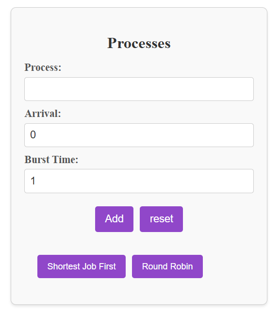
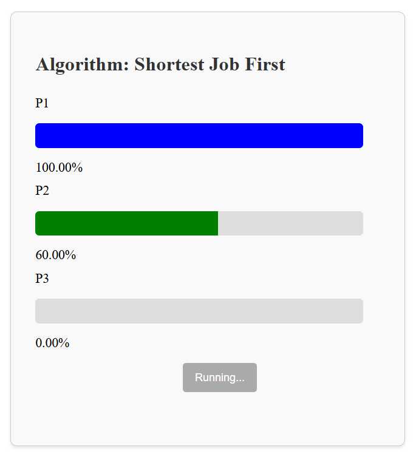
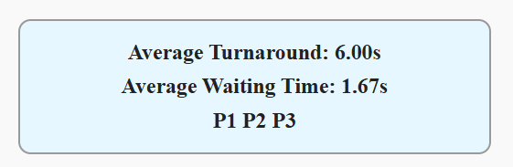

# CPU Scheduling Algorithms Simulator

This React application simulates two CPU scheduling algorithms: **Shortest Job First (SJF)** and **Round-Robin (RR)**. It visually demonstrates how processes are scheduled and managed by these algorithms, allowing users to understand their behavior and performance.

## Features

**Shortest Job First (SJF)**:
- A non-preemptive algorithm that schedules processes based on their burst time (the time it takes to execute).
- The process with the shortest burst time is executed first.
  
**Round-Robin (RR)**:
- A preemptive scheduling algorithm where each process is assigned a fixed time slice (quantum).
- Processes are executed in a circular order, and if a process doesn't finish within its quantum, it is placed back in the queue.

**Interactive Visualization**:
- A real-time graphical representation of how processes are scheduled in the CPU.
- Users can input different processes and their burst times to see the scheduling process in action.

## Screenshots






## Installation

Clone the repository:

```bash
git clone https://github.com/matheusbaeta/Scheduling-Algorithms.git
```

Navigate to the project directory:
```bash
cd Scheduling-Algorithms
```

Install dependencies:

```
npm install
```

Start the development server:

```bash
npm run dev
```

